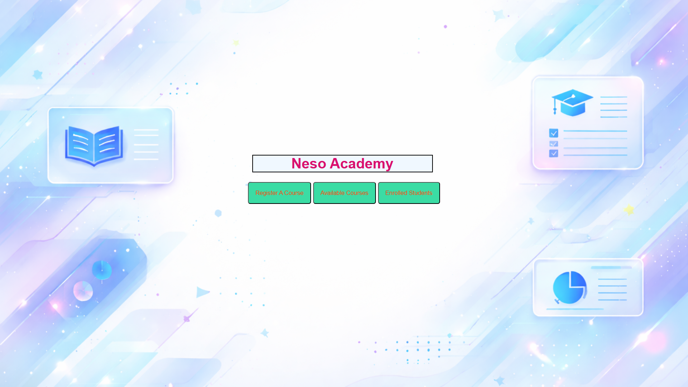

🎓 Full-Stack Course Registration System
📌 Overview

The Full-Stack Course Registration System is a production-ready web application designed to efficiently manage academic course enrollment workflows. It enables students to explore available courses, register seamlessly, and track their enrollments, while administrators can manage courses and users through secure backend services. The application is built using a modern full-stack architecture with clear separation of concerns, ensuring scalability, maintainability, and performance.

🏗️ System Architecture

The application follows a layered architecture, ensuring clean responsibility distribution across the system.

Frontend (Client Layer)
HTML, CSS, and JavaScript are used to build a responsive and interactive user interface that communicates with backend services via REST APIs.

Backend (Application Layer)
Spring Boot powers the backend, handling business logic, request validation, API orchestration, and secure data access using Spring MVC and Spring Data JPA.

Database (Persistence Layer)
A relational SQL database is used to ensure structured, consistent, and reliable data storage.

🎨 Frontend Details

The frontend is built using HTML5, CSS3, and JavaScript, focusing on usability, responsiveness, and clean UI design. It is responsible for rendering the course catalog, handling user interactions such as course registration and viewing enrollments, and communicating with backend REST endpoints using HTTP requests.

The frontend dynamically updates the UI based on API responses, ensuring a smooth and interactive user experience without unnecessary page reloads.

⚙️ Backend Details

The backend is implemented using Spring Boot, following enterprise-grade development practices. It exposes RESTful APIs using Spring MVC and manages persistence using Spring Data JPA with Hibernate ORM. The service layer encapsulates all business logic, ensuring clean separation between controllers and data access layers.

Optional integration with Spring Security allows role-based authentication and authorization, enabling secure access for different user roles such as students and administrators.

🗄️ Database Design

The application uses a SQL-based relational database (such as MySQL or PostgreSQL) to store structured data efficiently. The schema is properly normalized with clearly defined relationships between core entities such as users, courses, and enrollments.

Spring Data JPA handles entity-to-table mapping, while transactional management ensures data consistency and integrity across operations.

🔐 Security (Extendable)

The system supports role-based access control, secure API endpoints, and input validation to prevent common vulnerabilities. The security layer is designed to be easily extendable for OAuth, JWT-based authentication, or third-party identity providers.

🚀 Application Flow

A user interacts with the frontend interface, which sends HTTP requests to the Spring Boot backend. The backend processes the request, applies business logic, communicates with the database, and returns structured JSON responses. The frontend then updates the UI dynamically based on the response, ensuring a seamless end-to-end flow.

🧪 Testing

Backend APIs are tested using tools like Postman to validate request handling, responses, and error scenarios. The frontend workflows are manually tested to ensure correct UI behavior, while validation and exception handling are enforced at the service layer.

📈 Scalability & Extensibility

The application is designed with scalability in mind and can be extended into a microservices-based architecture. Additional features such as notifications, payment integration, or external authentication providers can be incorporated with minimal architectural changes.
